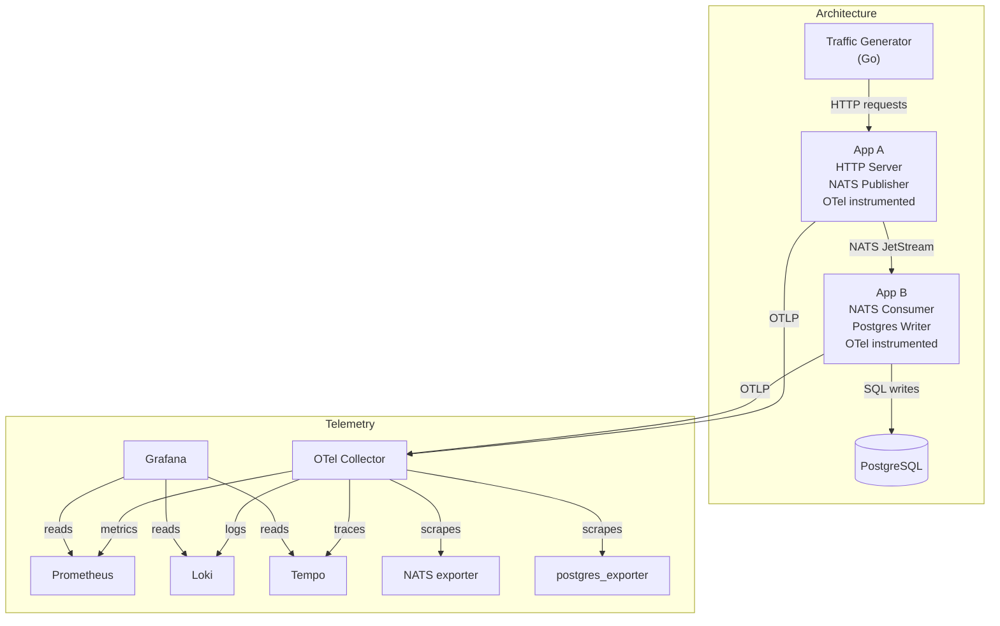

# Query Trainer

A self-contained learning environment designed to build practical fluency in PromQL, LogQL, and TraceQL. This project runs a realistic microservice pipeline fully instrumented with OpenTelemetry. It provides a Grafana dashboard structured as a query trainer: each topic presents a challenge panel alongside a reference panel showing the correct result, allowing you to write queries independently and immediately verify them visually.

The goal is pattern fluency. Rather than memorizing how to calculate a specific metric (like CPU usage), every exercise is built around reusable query patterns that apply across any stack.


## Why though?

In the real world, you shouldn't memorize specific queries, you should have mental models. When calculating the success rate of a microservice operation, you aren't just doing `success / total`, you are applying a **ratio pattern**. This distinction matters because metric names change across exporters, Kubernetes versions, and organizations. The patterns do not.

The three backends map to three distinct mental models:

- **Prometheus** deals in numeric time series. The fundamental skill is understanding metric types (counter, gauge, histogram) and knowing which functions are valid for each.
- **Loki** deals in log streams. The fundamental skill is filtering and parsing structured logs, then optionally converting them into metrics.
- **Tempo** deals in distributed traces. The fundamental skill is selecting spans by attribute and understanding the structural relationships between them.


## Architecture



## Stack

| Component | Role |
|---|---|
| App A | HTTP server, NATS publisher, OTel-instrumented Go service |
| App B | NATS consumer, PostgreSQL writer, OTel-instrumented Go service |
| Traffic Generator | Synthetic load generator targeting App A |
| NATS JetStream | Message queue between App A and App B |
| PostgreSQL | Persistence layer consumed by App B |
| postgres_exporter | Exposes PostgreSQL internal metrics to Prometheus |
| OTel Collector | Receives OTLP from both apps, scrapes NATS and Postgres exporters, fans out to all three backends |
| Prometheus | Metrics backend |
| Loki | Log aggregation backend |
| Tempo | Distributed tracing backend |
| Grafana | Visualization and query trainer interface |

---

## Services Detail

### App A

An HTTP server that accepts synthetic requests from the traffic generator and publishes a message to a NATS JetStream subject for each request.

Exposes via OTel SDK:

| Metric (Prometheus name) | Type | Labels |
|---|---|---|
| `http_server_request_count_total` | Counter | `method`, `route`, `status_code` |
| `http_server_request_duration_seconds` | Histogram | `method`, `route`, `status_code` |
| `messaging_publish_count_total` | Counter | `subject`, `status` |
| `messaging_publish_duration_seconds` | Histogram | `subject`, `status` |

Emits structured JSON logs to stdout. Emits OTel traces with spans for each HTTP handler and each NATS publish call.

### App B

A NATS JetStream consumer that reads messages published by App A and writes a record to PostgreSQL for each one.

Exposes via OTel SDK:

| Metric (Prometheus name) | Type | Labels |
|---|---|---|
| `messaging_consume_count_total` | Counter | `subject`, `status` |
| `messaging_process_duration_seconds` | Histogram | `subject`, `status` |
| `messaging_consumer_lag` | Gauge | `subject` |
| `db_query_duration_seconds` | Histogram | `operation`, `table`, `status` |
| `db_connections_active` | Gauge | (none) |
| `db_connections_idle` | Gauge | (none) |

Emits structured JSON logs to stdout. Emits OTel traces with spans for each message consumed, each DB write, and the end-to-end processing pipeline.

### NATS JetStream

Runs with the built-in Prometheus exporter enabled. Exposes metrics including:

- `nats_core_mem_bytes` — process memory usage (gauge)
- `nats_core_msgs_total` — total messages routed (counter)
- `nats_core_bytes_total` — total bytes routed (counter)
- `nats_jetstream_consumer_num_pending` — consumer lag (gauge)
- `nats_jetstream_stream_total_messages` — messages in stream (gauge)
- `nats_jetstream_api_total` — JetStream API calls (counter)

These metrics provide a third-party exporter perspective that is different from the application-level metrics, and are intentionally included to practice querying infrastructure components you did not write.

### PostgreSQL

Exposed via `postgres_exporter`. Key metrics include:

- `pg_stat_activity_count` — active connections by state (gauge)
- `pg_stat_bgwriter_buffers_alloc_total` — buffer allocation rate (counter)
- `pg_database_size_bytes` — database size on disk (gauge)
- `pg_stat_user_tables_n_live_tup` — estimated live rows per table (gauge)
- `pg_locks_count` — lock count by mode and database (gauge)
- `pg_stat_statements_mean_exec_time_ms` — mean query execution time (gauge, requires pg_stat_statements extension)

---

## Log Schema

To provide a realistic parsing challenge, the applications emit logs in two different formats. The OTel Collector collects both streams and forwards them to Loki.

### App A (JSON Format)
App A writes structured JSON logs to stdout. This requires the `| json` parser in LogQL.

```json
{
  "timestamp": "2024-01-15T10:30:00.123Z",
  "level": "info",
  "service": "app-a",
  "version": "0.1.0",
  "environment": "local",
  "trace_id": "4bf92f3577b34da6a3ce929d0e0e4736",
  "span_id": "00f067aa0ba902b7",
  "request_id": "01HQ4V2WK5XVPN3J8MD6GRTYES",
  "message": "request processed",
  "http_method": "POST",
  "http_route": "/api/messages",
  "http_status_code": 200,
  "duration_ms": 45
}
```

### App B (Pipe-Separated Format)

App B writes plain text logs separated by pipes (|). The fields follow the industry-standard progression from general metadata to specific execution context:

`Timestamp | Level | Service | Version | Environment | TraceID | SpanID | RequestID | Message | [Extra Context]`

Example:

```txt
2024-01-15T10:30:00.250Z | INFO | app-b | 0.1.0 | local | 4bf92f3577b34da6a3ce929d0e0e4736 | 08a3c2b192e47109 | 01HQ4V2WK5XVPN3J8MD6GRTYES | message processed | db.system=postgresql | db.operation=INSERT | db.table=public.messages
```

### Correlation & Parsing

The trace_id field is the W3C TraceContext trace ID propagated from the incoming HTTP request through NATS message headers into App B. This is the field that enables log-to-trace correlation in Grafana: clicking a trace ID in a Loki log panel can navigate directly to that trace in Tempo.

The request_id is a ULID generated per HTTP request in App A and propagated in the NATS message payload to App B. It allows correlating logs across both services for a single end-to-end request, crossing the JSON and Pipe-separated format boundary.

**Loki Label Extraction:**

Regardless of the log format, the OTel Collector extracts the following low-cardinality fields and promotes them to Loki labels before shipping:

| Label | Values |
|---|---|
| `service` | `app-a`, `app-b` |
| `level` | `debug`, `info`, `warn`, `error` |
| `environment` | `local` |
| `version` | semver string |

All other fields (including trace IDs and request IDs) remain in the log line and must be extracted at query time using LogQL's `| json` (for App A) or `| pattern` (for App B) operators.

## Trace Schema

Both apps instrument the following spans:

**App A:**
- `POST /api/messages` — root span, HTTP handler
  - Attributes: `http.method`, `http.route`, `http.status_code`, `http.request_content_length`
  - Child: `nats.publish` — NATS publish call
    - Attributes: `messaging.system=nats`, `messaging.destination`, `messaging.operation=publish`

**App B:**
- `nats.consume` — root span, message processing
  - Attributes: `messaging.system=nats`, `messaging.destination`, `messaging.operation=receive`, `messaging.message.id`
  - Child: `db.insert` — PostgreSQL write
    - Attributes: `db.system=postgresql`, `db.operation=INSERT`, `db.sql.table`, `db.statement` (sanitized)

All spans carry `service.name`, `service.version`, `deployment.environment`, and the W3C trace context. Error spans set `otel.status_code=ERROR` and include `exception.type`, `exception.message`, and `exception.stacktrace` as span events.

---

## Dashboard Design

The trainer dashboard is organized into three sections, one per backend. Within each section, exercises are grouped by pattern category. Each exercise consists of two panels placed side by side:

- **Right panel (challenge):** Contains a description of the objective, the metric or log stream to use, and context explaining why the pattern is useful. The panel datasource and visualization type are pre-configured. The query field is empty.
- **Left panel (reference):** Contains the correct query already written and rendering live data. This panel exists so you can verify your result visually and inspect the query if needed.

The reference panel is visible by default. Whether you consult it before or after writing your query is left to your own judgment. The value of the tool depends entirely on attempting the query first.

---

## Getting Started

```bash
git clone query-trainer
cd query-trainer
docker compose up -d
```

Wait approximately 30 seconds for all services to initialize, then open Grafana at `http://localhost:3000`.

| Credential | Value |
|---|---|
| Username | `admin` |
| Password | `queries_are_fun` |

The dashboard named **Observability Query Trainer** is provisioned automatically. Datasources for Prometheus, Loki, and Tempo are provisioned automatically.

---

## Status

This repository documents the intended end state. Implementation is in progress. The pattern reference documents in `docs/` define the scope of the dashboard and serve as the specification for which metrics, log fields, and trace attributes the applications must emit.
